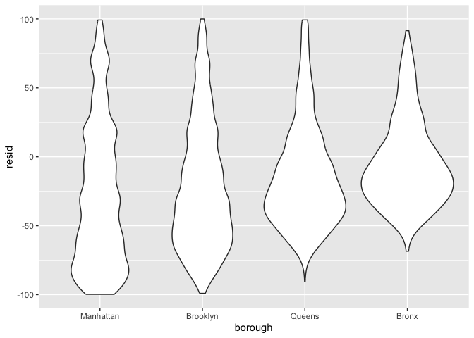
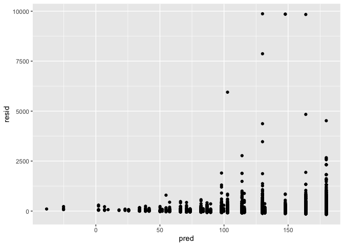

Linear_models
================
Kimberly Lopez
2024-11-07

**Example**

``` r
library(tidyverse)
```

    ## ── Attaching core tidyverse packages ──────────────────────── tidyverse 2.0.0 ──
    ## ✔ dplyr     1.1.4     ✔ readr     2.1.5
    ## ✔ forcats   1.0.0     ✔ stringr   1.5.1
    ## ✔ ggplot2   3.5.1     ✔ tibble    3.2.1
    ## ✔ lubridate 1.9.3     ✔ tidyr     1.3.1
    ## ✔ purrr     1.0.2     
    ## ── Conflicts ────────────────────────────────────────── tidyverse_conflicts() ──
    ## ✖ dplyr::filter() masks stats::filter()
    ## ✖ dplyr::lag()    masks stats::lag()
    ## ℹ Use the conflicted package (<http://conflicted.r-lib.org/>) to force all conflicts to become errors

``` r
library(p8105.datasets)

set.seed(1)
```

# Model fitting with the Airbnb data

First some data cleaning

``` r
data("nyc_airbnb")

nyc_airbnb = 
  nyc_airbnb |> 
  mutate(stars = review_scores_location / 2) |> 
  rename(
    borough = neighbourhood_group,
    neighborhood = neighbourhood) |> 
  filter(borough != "Staten Island") |> 
  select(price, stars, borough, neighborhood, room_type)
```

**Fit a simple model**

We can get the summary of a fit model using the `summary()` function. We
can also use `names()` to know the other variables from the model
fitted.

- we can extract the coefficents of the model using `coef()`
- or we can use `broom::tidy()` to return values in a tibble
- `broom::glance()`

``` r
fit = lm(price ~ stars, data = nyc_airbnb)

summary(fit)
```

    ## 
    ## Call:
    ## lm(formula = price ~ stars, data = nyc_airbnb)
    ## 
    ## Residuals:
    ##    Min     1Q Median     3Q    Max 
    ## -144.1  -69.1  -32.0   25.9 9889.0 
    ## 
    ## Coefficients:
    ##             Estimate Std. Error t value Pr(>|t|)    
    ## (Intercept)  -66.500     11.893  -5.591 2.27e-08 ***
    ## stars         44.115      2.515  17.538  < 2e-16 ***
    ## ---
    ## Signif. codes:  0 '***' 0.001 '**' 0.01 '*' 0.05 '.' 0.1 ' ' 1
    ## 
    ## Residual standard error: 183.8 on 30528 degrees of freedom
    ##   (9962 observations deleted due to missingness)
    ## Multiple R-squared:  0.009974,   Adjusted R-squared:  0.009942 
    ## F-statistic: 307.6 on 1 and 30528 DF,  p-value: < 2.2e-16

``` r
names(fit)
```

    ##  [1] "coefficients"  "residuals"     "effects"       "rank"         
    ##  [5] "fitted.values" "assign"        "qr"            "df.residual"  
    ##  [9] "na.action"     "xlevels"       "call"          "terms"        
    ## [13] "model"

``` r
coef(fit)
```

    ## (Intercept)       stars 
    ##   -66.50023    44.11475

``` r
fit|>
  broom::tidy()|>
  select(term,estimate,p.value)
```

    ## # A tibble: 2 × 3
    ##   term        estimate  p.value
    ##   <chr>          <dbl>    <dbl>
    ## 1 (Intercept)    -66.5 2.27e- 8
    ## 2 stars           44.1 1.61e-68

**A bit more advance simple model**

Linear model with two variables

``` r
fit = lm(price ~ stars + borough, data = nyc_airbnb)

fit|> 
  broom::tidy()|>
  select(term,estimate,p.value)|>
  mutate(
    term= str_replace(term, "borough", "Borough: "))|>
      knitr::kable(digits=3)
```

| term               | estimate | p.value |
|:-------------------|---------:|--------:|
| (Intercept)        |  -70.414 |   0.000 |
| stars              |   31.990 |   0.000 |
| Borough: Brooklyn  |   40.500 |   0.000 |
| Borough: Manhattan |   90.254 |   0.000 |
| Borough: Queens    |   13.206 |   0.145 |

WE reload the data to apply the correct factors in accordance to

It’s important to note that changing reference categories won’t change
“fit” or statistical sigificance, but can affect ease of interpretation.

Now the data will show the same values, but in comparason to the
refereance group:

``` r
nyc_airbnb = 
  nyc_airbnb |> 
  mutate(
    borough = fct_infreq(borough),
    room_type = fct_infreq(room_type))


fit = lm(price ~ stars + borough, data = nyc_airbnb)

fit|> 
  broom::tidy()|>
  select(term,estimate,p.value)|>
  mutate(
    term= str_replace(term, "borough", "Borough: "))|>
      knitr::kable(digits=3)
```

| term              | estimate | p.value |
|:------------------|---------:|--------:|
| (Intercept)       |   19.839 |   0.104 |
| stars             |   31.990 |   0.000 |
| Borough: Brooklyn |  -49.754 |   0.000 |
| Borough: Queens   |  -77.048 |   0.000 |
| Borough: Bronx    |  -90.254 |   0.000 |

# Tidying output

# Diagnostics

**Most diagnostics use residuals**

First some exploratory data anlysis

``` r
 nyc_airbnb|>
  ggplot(aes(x=stars,y=price))+
  geom_point()+
  stat_smooth(method= "lm")
```

    ## `geom_smooth()` using formula = 'y ~ x'

    ## Warning: Removed 9962 rows containing non-finite outside the scale range
    ## (`stat_smooth()`).

    ## Warning: Removed 9962 rows containing missing values or values outside the scale range
    ## (`geom_point()`).

<!-- -->

The `modelr` package can be used to add residuals and fitted values to a
dataframe.

``` r
modelr::add_residuals(nyc_airbnb, fit)
```

    ## # A tibble: 40,492 × 6
    ##    price stars borough neighborhood room_type        resid
    ##    <dbl> <dbl> <fct>   <chr>        <fct>            <dbl>
    ##  1    99   5   Bronx   City Island  Private room      9.47
    ##  2   200  NA   Bronx   City Island  Private room     NA   
    ##  3   300  NA   Bronx   City Island  Entire home/apt  NA   
    ##  4   125   5   Bronx   City Island  Entire home/apt  35.5 
    ##  5    69   5   Bronx   City Island  Private room    -20.5 
    ##  6   125   5   Bronx   City Island  Entire home/apt  35.5 
    ##  7    85   5   Bronx   City Island  Entire home/apt  -4.53
    ##  8    39   4.5 Bronx   Allerton     Private room    -34.5 
    ##  9    95   5   Bronx   Allerton     Entire home/apt   5.47
    ## 10   125   4.5 Bronx   Allerton     Entire home/apt  51.5 
    ## # ℹ 40,482 more rows

We can plot them with a violin plot

``` r
modelr::add_residuals(nyc_airbnb, fit)|>
  ggplot(aes(x=borough, y=resid))+
  geom_violin()+
  ylim(-100,100)
```

    ## Warning: Removed 14800 rows containing non-finite outside the scale range
    ## (`stat_ydensity()`).

<!-- -->

We can plot the residua;s against stars which results in a skewed plot.

``` r
nyc_airbnb|>
  modelr::add_residuals(fit)|>
  modelr::add_predictions(fit)|>
  ggplot(aes(x=pred, y= resid))+ 
  geom_point()
```

    ## Warning: Removed 9962 rows containing missing values or values outside the scale range
    ## (`geom_point()`).

<!-- -->

# Hypothesis Testing

Model summaries include results of t-tests for single coefficients, and
are the standard way of assessing statistical significance.

Testing multiple coefficients is somewhat more complicated. A useful
approach is to use nested models, meaning that the terms in a simple
“null” model are a subset of the terms in a more complex “alternative”
model

**When adding more than one variable use `ANOVA`:**

Using a mixed model is reasonable for more than 2 but still low
variables.

``` r
fit_null = lm(price ~ stars + borough, data = nyc_airbnb)
fit_alt = lm(price ~ stars + borough + room_type, data = nyc_airbnb)
```

Anova only works if your doing nested models

``` r
fit_null|>
  broom::tidy()
```

    ## # A tibble: 5 × 5
    ##   term            estimate std.error statistic   p.value
    ##   <chr>              <dbl>     <dbl>     <dbl>     <dbl>
    ## 1 (Intercept)         19.8     12.2       1.63 1.04e-  1
    ## 2 stars               32.0      2.53     12.7  1.27e- 36
    ## 3 boroughBrooklyn    -49.8      2.23    -22.3  6.32e-109
    ## 4 boroughQueens      -77.0      3.73    -20.7  2.58e- 94
    ## 5 boroughBronx       -90.3      8.57    -10.5  6.64e- 26

``` r
fit_alt|> 
  broom::tidy()
```

    ## # A tibble: 7 × 5
    ##   term                  estimate std.error statistic  p.value
    ##   <chr>                    <dbl>     <dbl>     <dbl>    <dbl>
    ## 1 (Intercept)              113.      11.8       9.54 1.56e-21
    ## 2 stars                     21.9      2.43      9.01 2.09e-19
    ## 3 boroughBrooklyn          -40.3      2.15    -18.8  4.62e-78
    ## 4 boroughQueens            -55.5      3.59    -15.4  1.32e-53
    ## 5 boroughBronx             -63.0      8.22     -7.67 1.76e-14
    ## 6 room_typePrivate room   -105.       2.05    -51.2  0       
    ## 7 room_typeShared room    -129.       6.15    -21.0  2.24e-97

``` r
anova(fit_null,fit_alt)|>
  broom::tidy()
```

    ## # A tibble: 2 × 7
    ##   term                        df.residual    rss    df   sumsq statistic p.value
    ##   <chr>                             <dbl>  <dbl> <dbl>   <dbl>     <dbl>   <dbl>
    ## 1 price ~ stars + borough           30525 1.01e9    NA NA            NA       NA
    ## 2 price ~ stars + borough + …       30523 9.21e8     2  8.42e7     1394.       0

# Nesting Data

**Do effects differ across broughs**

Does increasing price in manhatten or brooklyn have an affect? Does
shared rooms in brooklyn versus manhatten differ?

First use

``` r
nyc_airbnb |> 
  lm(price ~ stars * borough + room_type * borough, data = _) |> 
  broom::tidy() |> 
  knitr::kable(digits = 3)
```

| term                                  | estimate | std.error | statistic | p.value |
|:--------------------------------------|---------:|----------:|----------:|--------:|
| (Intercept)                           |   95.694 |    19.184 |     4.988 |   0.000 |
| stars                                 |   27.110 |     3.965 |     6.838 |   0.000 |
| boroughBrooklyn                       |  -26.066 |    25.080 |    -1.039 |   0.299 |
| boroughQueens                         |   -4.118 |    40.674 |    -0.101 |   0.919 |
| boroughBronx                          |   -5.627 |    77.808 |    -0.072 |   0.942 |
| room_typePrivate room                 | -124.188 |     2.996 |   -41.457 |   0.000 |
| room_typeShared room                  | -153.635 |     8.692 |   -17.676 |   0.000 |
| stars:boroughBrooklyn                 |   -6.139 |     5.237 |    -1.172 |   0.241 |
| stars:boroughQueens                   |  -17.455 |     8.539 |    -2.044 |   0.041 |
| stars:boroughBronx                    |  -22.664 |    17.099 |    -1.325 |   0.185 |
| boroughBrooklyn:room_typePrivate room |   31.965 |     4.328 |     7.386 |   0.000 |
| boroughQueens:room_typePrivate room   |   54.933 |     7.459 |     7.365 |   0.000 |
| boroughBronx:room_typePrivate room    |   71.273 |    18.002 |     3.959 |   0.000 |
| boroughBrooklyn:room_typeShared room  |   47.797 |    13.895 |     3.440 |   0.001 |
| boroughQueens:room_typeShared room    |   58.662 |    17.897 |     3.278 |   0.001 |
| boroughBronx:room_typeShared room     |   83.089 |    42.451 |     1.957 |   0.050 |

Then, We could also fit seperate models to see indivdually how they
interact in each borough.

We see effetc of room and stars in Manhattan only

``` r
nyc_airbnb|> 
  filter(borough=="Manhatten")|>
  lm(price ~ stars + room_type, data = _)|>
  broom::tidy()

nyc_airbnb|> 
  filter(borough=="Brooklyn")|>
  lm(price~ stars + room_type, data = _)|>
  broom::tidy()
```

Get fancy and use list columns instead

We can take data and put it into the argument element in lm which we can
then create a new column `model`. We can take it a step further and map
again using broom::tidy

**This is model fitting stuff**

``` r
nyc_airbnb|> 
  nest(data = -borough)|>
  mutate(
    model= map(data,\(x) lm(price ~ stars + room_type, data = x) ), 
    reuslts = map(model, broom::tidy)
  )
```

    ## # A tibble: 4 × 4
    ##   borough   data                  model  reuslts         
    ##   <fct>     <list>                <list> <list>          
    ## 1 Bronx     <tibble [649 × 4]>    <lm>   <tibble [4 × 5]>
    ## 2 Queens    <tibble [3,821 × 4]>  <lm>   <tibble [4 × 5]>
    ## 3 Brooklyn  <tibble [16,810 × 4]> <lm>   <tibble [4 × 5]>
    ## 4 Manhattan <tibble [19,212 × 4]> <lm>   <tibble [4 × 5]>

We can check specifically for each borough and unset the reuslts column
and tidy the data to get values on coefficients for each variable.

**This is more tidying stuff after model fitting**

``` r
nyc_airbnb|> 
  nest(data = -borough)|>
  mutate(
    model= map(data,\(x) lm(price ~ stars + room_type, data = x) ), 
    results = map(model, broom::tidy)
  )|>
  select(borough,results)|>
  unnest(results)|>
  select(borough, term, estimate)|>
  pivot_wider ( 
    names_from = term,
    values_from = estimate)
```

    ## # A tibble: 4 × 5
    ##   borough   `(Intercept)` stars `room_typePrivate room` `room_typeShared room`
    ##   <fct>             <dbl> <dbl>                   <dbl>                  <dbl>
    ## 1 Bronx              90.1  4.45                   -52.9                  -70.5
    ## 2 Queens             91.6  9.65                   -69.3                  -95.0
    ## 3 Brooklyn           69.6 21.0                    -92.2                 -106. 
    ## 4 Manhattan          95.7 27.1                   -124.                  -154.

**Question: What about room types across manahten neighbohoods?**

- we are filtering a variable borough to search for a specific borough
  and neighborhood

``` r
nyc_airbnb|> 
  filter( 
    borough== "Manhattan", 
    neighborhood == "Chinatown")|>
  lm(price~ stars+ room_type, data = _ )|>
  broom::tidy()
```

    ## # A tibble: 4 × 5
    ##   term                  estimate std.error statistic  p.value
    ##   <chr>                    <dbl>     <dbl>     <dbl>    <dbl>
    ## 1 (Intercept)              337.       60.4      5.59 5.66e- 8
    ## 2 stars                    -27.8      13.0     -2.14 3.34e- 2
    ## 3 room_typePrivate room   -109.       11.5     -9.52 1.03e-18
    ## 4 room_typeShared room    -143.       93.2     -1.54 1.25e- 1

``` r
nyc_airbnb|> 
  filter( 
    borough== "Manhattan", 
    neighborhood == "Chelsea")|>
  lm(price~ stars+ room_type, data = _ )|>
  broom::tidy()
```

    ## # A tibble: 4 × 5
    ##   term                  estimate std.error statistic  p.value
    ##   <chr>                    <dbl>     <dbl>     <dbl>    <dbl>
    ## 1 (Intercept)              477.      135.       3.53 4.38e- 4
    ## 2 stars                    -44.5      27.3     -1.63 1.04e- 1
    ## 3 room_typePrivate room   -133.       12.7    -10.5  2.13e-24
    ## 4 room_typeShared room    -153.       36.2     -4.24 2.49e- 5

The results show they do differ by neighborhodos in the broough.

We can take this further for all nieghborhoods in Manhattan now which is
the same as above but now for all neighborhoods by using `nest` for
**borough and neighborhood**

``` r
manhatten_neighborhood_fit_df = 
  nyc_airbnb|> 
  filter(borough == "Manhattan")|>
  nest(data = -(borough:neighborhood))|>
  mutate(
    model = map (data, \(x) lm(price ~ stars + room_type, data = x )), 
    results = map(model, broom::tidy)
  )|> 
  select(neighborhood, results)|> 
  unnest(results)
```

**Tip: Do things once for a variable, then try to nest if its working,
then run the nesting code step by step to make sure no lines of code
break, and continu tidying**

We can then look at the effect of room type using the above df but
filtering by room_type.

``` r
manhatten_neighborhood_fit_df|> 
  filter(str_detect(term, "room_type"))
```

    ## # A tibble: 59 × 6
    ##    neighborhood      term                  estimate std.error statistic  p.value
    ##    <chr>             <chr>                    <dbl>     <dbl>     <dbl>    <dbl>
    ##  1 Battery Park City room_typePrivate room   -126.      27.6      -4.56 8.11e- 5
    ##  2 Battery Park City room_typeShared room    -160.      56.3      -2.84 7.96e- 3
    ##  3 Chinatown         room_typePrivate room   -109.      11.5      -9.52 1.03e-18
    ##  4 Chinatown         room_typeShared room    -143.      93.2      -1.54 1.25e- 1
    ##  5 Chelsea           room_typePrivate room   -133.      12.7     -10.5  2.13e-24
    ##  6 Chelsea           room_typeShared room    -153.      36.2      -4.24 2.49e- 5
    ##  7 Civic Center      room_typePrivate room    -95.3     28.9      -3.30 3.26e- 3
    ##  8 East Harlem       room_typePrivate room   -116.      26.1      -4.43 1.08e- 5
    ##  9 East Harlem       room_typeShared room    -144.      55.9      -2.57 1.04e- 2
    ## 10 East Village      room_typePrivate room   -113.       7.75    -14.6  4.70e-45
    ## # ℹ 49 more rows

Plot this dataframe:

``` r
manhatten_neighborhood_fit_df|> 
  filter(str_detect(term, "room_type"))|> 
  ggplot(aes(x= term, y = estimate))+ 
  geom_boxplot()
```

<!-- -->

# Binary Outcomes

``` r
baltimore_df = 
  read_csv("data/homicide-data.csv") |> 
  filter(city == "Baltimore") |> 
  mutate(
    resolved = as.numeric(disposition == "Closed by arrest"),
    victim_age = as.numeric(victim_age),
    victim_race = fct_relevel(victim_race, "White")) |> 
  select(resolved, victim_age, victim_race, victim_sex)
```

    ## Rows: 52179 Columns: 12
    ## ── Column specification ────────────────────────────────────────────────────────
    ## Delimiter: ","
    ## chr (9): uid, victim_last, victim_first, victim_race, victim_age, victim_sex...
    ## dbl (3): reported_date, lat, lon
    ## 
    ## ℹ Use `spec()` to retrieve the full column specification for this data.
    ## ℹ Specify the column types or set `show_col_types = FALSE` to quiet this message.

``` r
head(baltimore_df)
```

    ## # A tibble: 6 × 4
    ##   resolved victim_age victim_race victim_sex
    ##      <dbl>      <dbl> <fct>       <chr>     
    ## 1        0         17 Black       Male      
    ## 2        0         26 Black       Male      
    ## 3        0         21 Black       Male      
    ## 4        1         61 White       Male      
    ## 5        1         46 Black       Male      
    ## 6        1         27 Black       Male
