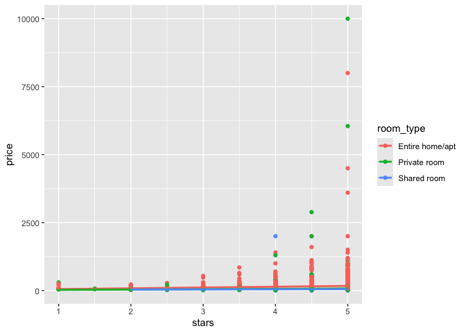
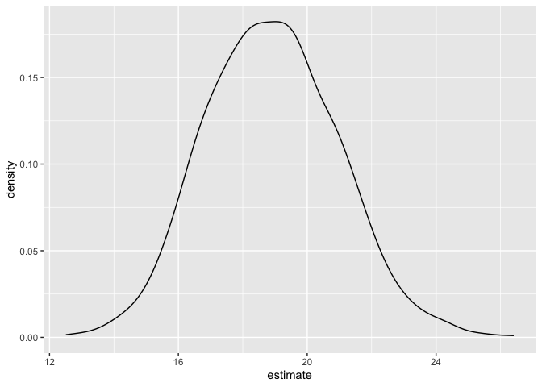

Bootstrapping
================
Kimberly Lopez
2024-11-14

``` r
library(tidyverse)
```

    ## ── Attaching core tidyverse packages ──────────────────────── tidyverse 2.0.0 ──
    ## ✔ dplyr     1.1.4     ✔ readr     2.1.5
    ## ✔ forcats   1.0.0     ✔ stringr   1.5.1
    ## ✔ ggplot2   3.5.1     ✔ tibble    3.2.1
    ## ✔ lubridate 1.9.3     ✔ tidyr     1.3.1
    ## ✔ purrr     1.0.2     
    ## ── Conflicts ────────────────────────────────────────── tidyverse_conflicts() ──
    ## ✖ dplyr::filter() masks stats::filter()
    ## ✖ dplyr::lag()    masks stats::lag()
    ## ℹ Use the conflicted package (<http://conflicted.r-lib.org/>) to force all conflicts to become errors

``` r
library(p8105.datasets)

set.seed(1)
```

# Bootstrapping in Simple Linear Regression

sim_df_const and sim_df_nonconstant

First I’ll generate x, then an error sampled from a normal distribution,
and then a response y; this all gets stored in sim_df_const. Then I’ll
modify this by multiplying the errors by a term that involves x, and
create a new response variable y

``` r
n_samp= 250 


sim_df_const = 
  tibble(
    x = rnorm(n_samp, 1, 1),
    error = rnorm(n_samp, 0, 1),
    y = 2 + 3 * x + error
  )

sim_df_nonconst = sim_df_const |> 
  mutate(
  error = error * .75 * x,
  y = 2 + 3 * x + error
)
```

Graphing sim_df_const:

``` r
sim_df_const|>
  ggplot(aes(x=x,y=y))+ 
  geom_point() + 
  stat_smooth(method = "lm")
```

    ## `geom_smooth()` using formula = 'y ~ x'

<!-- -->

Graphing sim_df_noncon

``` r
sim_df_nonconst|>
  ggplot(aes(x=x,y=y))+ 
  geom_point() + 
  stat_smooth(method = "lm")
```

    ## `geom_smooth()` using formula = 'y ~ x'

<!-- -->

These confidence intervals are not accurate since the uncertainy area
does not hold the observations

Looking at the regression reults we see the similar thing

``` r
sim_df_const|>
  lm(y~x, data = _) |>
  broom::tidy()|>
  knitr::kable(digits=3)
```

| term        | estimate | std.error | statistic | p.value |
|:------------|---------:|----------:|----------:|--------:|
| (Intercept) |    1.977 |     0.098 |    20.157 |       0 |
| x           |    3.045 |     0.070 |    43.537 |       0 |

WE should be getting differences in standard errors since assumptions of
equal variances are violated despite p-value.

# Drawing one bootstrap sample

This function should have the data frame as the argument, and should
return a sample from that dataframe drawn with replacement. **This has a
defualt of size 1 since it is constant, but we need to change
replace=TRUE to ensure we dont use the same data over again**

``` r
boot_sample = function(df) {
  sample_frac(df, replace = TRUE)
}
```

``` r
sim_df_nonconst|>
  boot_sample()|>
  ggplot(aes(x=x, y=y))+ 
  geom_point(alpha=.5)+ 
  stat_smooth(method="lm")
```

    ## `geom_smooth()` using formula = 'y ~ x'

<!-- -->

We can do this bootstrap method as part of an analysis

``` r
sim_df_nonconst|>
  boot_sample()|>
  lm(y~x, data = _) |>
  broom::tidy()|>
  knitr::kable(digits=3)
```

| term        | estimate | std.error | statistic | p.value |
|:------------|---------:|----------:|----------:|--------:|
| (Intercept) |    1.896 |     0.098 |    19.311 |       0 |
| x           |    3.142 |     0.069 |    45.636 |       0 |

# Drawing many bootstrap samples

We can save these estimated samples

We’re going to draw repeated samples with replacement, and then analyze
each of those samples separately. It would be really great to have a
data structure that makes it possible to keep track of everything. Maybe
a **list column**!

- starts with a tibble
- then mutate by mapping across all strap_numbers
- **check code by using boot_straps\|\>pull(strap_sample)\|\> nth(2) **
- used (i) and (df) to identify anonymous function
- model runs the linear regresion on each bootstrap
- results tidies the models

``` r
boot_straps = 
  tibble(
    strap_number = 1:10
  )|>
  mutate(
    strap_sample = map(strap_number, \(i) boot_sample(df = sim_df_nonconst)),
    models = map(strap_sample, \(df) lm (y~x, data = df)),
    results= map(models, broom::tidy)
    )

boot_straps
```

    ## # A tibble: 10 × 4
    ##    strap_number strap_sample       models results         
    ##           <int> <list>             <list> <list>          
    ##  1            1 <tibble [250 × 3]> <lm>   <tibble [2 × 5]>
    ##  2            2 <tibble [250 × 3]> <lm>   <tibble [2 × 5]>
    ##  3            3 <tibble [250 × 3]> <lm>   <tibble [2 × 5]>
    ##  4            4 <tibble [250 × 3]> <lm>   <tibble [2 × 5]>
    ##  5            5 <tibble [250 × 3]> <lm>   <tibble [2 × 5]>
    ##  6            6 <tibble [250 × 3]> <lm>   <tibble [2 × 5]>
    ##  7            7 <tibble [250 × 3]> <lm>   <tibble [2 × 5]>
    ##  8            8 <tibble [250 × 3]> <lm>   <tibble [2 × 5]>
    ##  9            9 <tibble [250 × 3]> <lm>   <tibble [2 × 5]>
    ## 10           10 <tibble [250 × 3]> <lm>   <tibble [2 × 5]>

``` r
boot_strap_results = 
  boot_straps|>
  select(strap_number, results)|>
  unnest(results)

boot_strap_results
```

    ## # A tibble: 20 × 6
    ##    strap_number term        estimate std.error statistic   p.value
    ##           <int> <chr>          <dbl>     <dbl>     <dbl>     <dbl>
    ##  1            1 (Intercept)     1.89    0.118       16.0 4.78e- 40
    ##  2            1 x               3.12    0.0843      37.0 5.32e-103
    ##  3            2 (Intercept)     2.06    0.0976      21.1 3.71e- 57
    ##  4            2 x               2.97    0.0690      43.1 2.89e-117
    ##  5            3 (Intercept)     2.04    0.102       20.0 9.03e- 54
    ##  6            3 x               3.03    0.0699      43.3 1.43e-117
    ##  7            4 (Intercept)     1.90    0.113       16.8 1.01e- 42
    ##  8            4 x               3.18    0.0772      41.2 7.18e-113
    ##  9            5 (Intercept)     1.95    0.112       17.3 1.22e- 44
    ## 10            5 x               2.97    0.0787      37.8 6.61e-105
    ## 11            6 (Intercept)     1.96    0.112       17.4 5.05e- 45
    ## 12            6 x               3.23    0.0792      40.8 4.11e-112
    ## 13            7 (Intercept)     1.93    0.0910      21.3 8.65e- 58
    ## 14            7 x               3.16    0.0640      49.4 2.91e-130
    ## 15            8 (Intercept)     1.76    0.0979      18.0 7.79e- 47
    ## 16            8 x               3.22    0.0670      48.1 8.76e-128
    ## 17            9 (Intercept)     2.02    0.100       20.1 6.79e- 54
    ## 18            9 x               3.03    0.0746      40.6 1.24e-111
    ## 19           10 (Intercept)     2.04    0.0858      23.8 7.12e- 66
    ## 20           10 x               2.90    0.0661      43.9 5.20e-119

Now we can look at the effect of bootstrap and standard error

``` r
boot_strap_results_se = 
  boot_straps|>
  select(strap_number, results)|>
  unnest(results)|>
  group_by(term)|>
  summarize(
    boot_se= sd(estimate)
  )

boot_strap_results_se
```

    ## # A tibble: 2 × 2
    ##   term        boot_se
    ##   <chr>         <dbl>
    ## 1 (Intercept)  0.0906
    ## 2 x            0.116

**Using the bootsrap when the sample assumptio is not violated, but it
gives you something you can do even when the assumptions are violated**

# Doing the same thing using `modelr`

- when you use modelr some cases you need to turn the modelr into a
  tibble
- could be more clear creating the bootstrap by ‘modelr’ instead of
  ‘map’

``` r
boot_straps = 
  sim_df_nonconst |> 
  modelr::bootstrap(n = 1000)|>
  mutate(
    strap= map(strap,as_tibble),
    models= map(strap,\(df) lm(y~x, data = df)),
    results = map(models, broom::tidy)
  )|>
  select(.id, results)|>
  unnest(results)

boot_straps
```

    ## # A tibble: 2,000 × 6
    ##    .id   term        estimate std.error statistic   p.value
    ##    <chr> <chr>          <dbl>     <dbl>     <dbl>     <dbl>
    ##  1 0001  (Intercept)     2.02    0.107       18.9 6.40e- 50
    ##  2 0001  x               3.03    0.0710      42.7 2.83e-116
    ##  3 0002  (Intercept)     1.92    0.0957      20.0 8.39e- 54
    ##  4 0002  x               3.14    0.0701      44.8 7.28e-121
    ##  5 0003  (Intercept)     1.91    0.101       18.9 5.66e- 50
    ##  6 0003  x               3.12    0.0689      45.3 6.46e-122
    ##  7 0004  (Intercept)     1.94    0.0907      21.3 4.66e- 58
    ##  8 0004  x               3.08    0.0680      45.4 3.99e-122
    ##  9 0005  (Intercept)     1.95    0.110       17.7 7.92e- 46
    ## 10 0005  x               3.13    0.0767      40.9 3.88e-112
    ## # ℹ 1,990 more rows

# What do we report

We can report the mean of all the estimates, and estimated standard eror
of the boot strap.

The reason we do bootstrapping is to construct a CI for an estimate,
upper and lower bound.

**Here we might have residual error but not skewed distribution.**

``` r
boot_straps|>
  group_by(term)|>
  summarize( 
    boot_est = mean(estimate),
    boot_se = sd(estimate), 
    boot_ci_lb = quantile(estimate,.025),
    boot_ci_ub = quantile(estimate,.975)
    )
```

    ## # A tibble: 2 × 5
    ##   term        boot_est boot_se boot_ci_lb boot_ci_ub
    ##   <chr>          <dbl>   <dbl>      <dbl>      <dbl>
    ## 1 (Intercept)     1.93  0.0746       1.79       2.08
    ## 2 x               3.11  0.101        2.91       3.31

# Bootstrapping on Airbnb

We saw previously the residual assumptions were not accurate

Here were going to run a regression of stars and room_type in Manhattan

``` r
data("nyc_airbnb")

manhattan_df = 
  nyc_airbnb |> 
  mutate(stars = review_scores_location / 2) |> 
  rename(
    borough = neighbourhood_group,
    neighborhood = neighbourhood) |> 
  filter(borough != "Manhattan") |> 
  drop_na(price, stars) |> 
  select(price, stars, room_type)
```

Plot the data

``` r
manhattan_df|> 
  ggplot(aes(x = stars, y = price, color = room_type)) + 
  geom_point() +
  stat_smooth( method="lm", se=FALSE)
```

    ## `geom_smooth()` using formula = 'y ~ x'

<!-- -->

Clearly this is not constant variance and assumptions are violated with
skewed distributions. Variance is much higher as stars increase. We can
fit a regression but

``` r
manhattan_df |> 
  lm(price~ stars + room_type, data = _)|>
  broom::tidy() 
```

    ## # A tibble: 4 × 5
    ##   term                  estimate std.error statistic   p.value
    ##   <chr>                    <dbl>     <dbl>     <dbl>     <dbl>
    ## 1 (Intercept)               73.6     11.9       6.18 6.61e- 10
    ## 2 stars                     18.9      2.52      7.47 8.24e- 14
    ## 3 room_typePrivate room    -88.7      2.30    -38.5  4.90e-310
    ## 4 room_typeShared room    -107.       7.16    -15.0  2.95e- 50

If sample size gets bigger, sample size helps reduce violation of
assumptions, but here we have limited data samples. so were going to run
bootstrap.

Bootstrap for better inference

``` r
manhattan_df|>
  modelr::bootstrap(10)|>
  mutate(
    
    strap= map(strap, as_tibble) ,
    models = map(strap, \(df) lm(price ~ stars + room_type, data = df)),
    results = map(models, broom::tidy))  |>
  select(.id, results )|>
  unnest(results)
```

    ## # A tibble: 40 × 6
    ##    .id   term                  estimate std.error statistic  p.value
    ##    <chr> <chr>                    <dbl>     <dbl>     <dbl>    <dbl>
    ##  1 01    (Intercept)               74.7     11.0       6.80 1.09e-11
    ##  2 01    stars                     18.5      2.32      7.98 1.61e-15
    ##  3 01    room_typePrivate room    -88.8      2.12    -41.9  0       
    ##  4 01    room_typeShared room    -112.       6.47    -17.4  4.61e-67
    ##  5 02    (Intercept)               72.3     10.6       6.84 8.42e-12
    ##  6 02    stars                     18.7      2.24      8.35 7.27e-17
    ##  7 02    room_typePrivate room    -86.0      2.07    -41.6  0       
    ##  8 02    room_typeShared room    -106.       6.40    -16.6  1.97e-61
    ##  9 03    (Intercept)               75.3     11.9       6.34 2.33e-10
    ## 10 03    stars                     18.8      2.52      7.48 7.78e-14
    ## # ℹ 30 more rows

We can visualize this: for 1000 samples

``` r
manhattan_df|>
  modelr::bootstrap(1000)|>
  mutate(
    
    strap= map(strap, as_tibble) ,
    models = map(strap, \(df) lm(price ~ stars + room_type, data = df)),
    results = map(models, broom::tidy))  |>
  select(.id, results )|>
  unnest(results)|>
  filter(term == "stars")|>
  ggplot(aes(estimate))+ 
  geom_density()
```

<!-- -->

Eventually the estimates will become closer to being normally
distributed still not enough. This distribution has a heavy tail
extending to low values and a bit of a “shoulder”, features that may be
related to the frequency with which large outliers are included in the
bootstrap sample.

When reporting - report results - report
