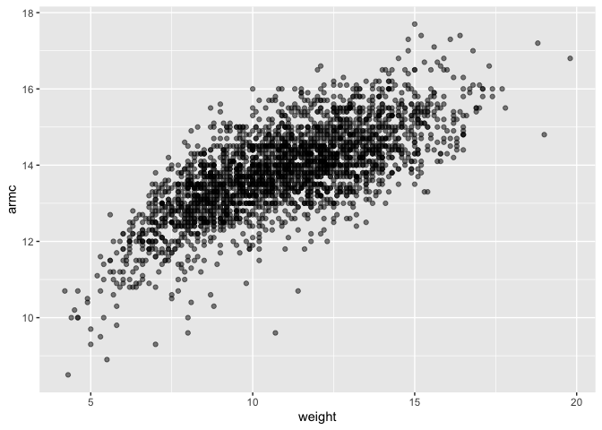

Cross Validation
================
Kimberly Lopez
2024-11-14

``` r
library(tidyverse)
```

    ## ── Attaching core tidyverse packages ──────────────────────── tidyverse 2.0.0 ──
    ## ✔ dplyr     1.1.4     ✔ readr     2.1.5
    ## ✔ forcats   1.0.0     ✔ stringr   1.5.1
    ## ✔ ggplot2   3.5.1     ✔ tibble    3.2.1
    ## ✔ lubridate 1.9.3     ✔ tidyr     1.3.1
    ## ✔ purrr     1.0.2     
    ## ── Conflicts ────────────────────────────────────────── tidyverse_conflicts() ──
    ## ✖ dplyr::filter() masks stats::filter()
    ## ✖ dplyr::lag()    masks stats::lag()
    ## ℹ Use the conflicted package (<http://conflicted.r-lib.org/>) to force all conflicts to become errors

``` r
library(modelr)
library(mgcv)
```

    ## Loading required package: nlme
    ## 
    ## Attaching package: 'nlme'
    ## 
    ## The following object is masked from 'package:dplyr':
    ## 
    ##     collapse
    ## 
    ## This is mgcv 1.9-1. For overview type 'help("mgcv-package")'.

``` r
library(SemiPar)

set.seed(1)
```

working with the Lidar dataset

``` r
data("lidar")

lidar_df = 
  lidar|>
  as_tibble()|>
  mutate( id= row_number())
```

Graphing the Lidar data:

``` r
lidar_df|>
  ggplot( aes(x= range, y = logratio))+ 
  geom_point()
```

<!-- -->

**Is this model too complex to fit a linear relationship?**

# Cross Validation

We will compare 3 models, linear, smooth, wiggly

Frist, contruct training and testing data

``` r
train_df = sample_frac(lidar_df, size = .8)

test_df = anti_join(lidar_df, train_df, by = "id")
```

Visualizing Training data:

``` r
ggplot(train_df, aes(x= range, y = logratio))+ 
  geom_point()+ 
  geom_point(data = test_df, color = "red")
```

<!-- -->

Now we can start fitting one model: –\> one model will be too simple or
too complex and make incorrect predictions.

Three models:

``` r
linear_mod= lm(logratio ~ range, data = train_df)
smooth_mod= gam(logratio ~ s(range), data = train_df)
wiggly_mod = gam(logratio ~ s(range, k = 30, sp= 10e-6), data = train_df)
```

Visualize the model fits:

**Linear fit**

``` r
train_df|>
  add_predictions(linear_mod)|> 
  ggplot(aes(x=range, y = logratio))+ 
  geom_point() + 
  geom_line(aes(y = pred), color = "red")
```

<!-- -->

- This is not complex enough since some of the datapoints are not linear

**Wiggly model fit**

``` r
train_df|>
  add_predictions(wiggly_mod)|> 
  ggplot(aes(x=range, y = logratio))+ 
  geom_point() + 
  geom_line(aes(y = pred), color = "red")
```

<!-- -->

- this over fits the training data on the model, so we cannot generalize
  this for a different dataset

**Smooth model fit**

- We use `gam` when data is not linear

``` r
train_df|>
  add_predictions(smooth_mod)|> 
  ggplot(aes(x=range, y = logratio))+ 
  geom_point() + 
  geom_line(aes(y = pred), color = "red")
```

<!-- -->

- this is better than linear since it captures the trends in the data,
  but not too flexible that will cause overfitting

**Compare these numerically using RMSE**

``` r
rmse(linear_mod, test_df)
```

    ## [1] 0.127317

``` r
rmse(smooth_mod, test_df)
```

    ## [1] 0.08302008

``` r
rmse(wiggly_mod, test_df)
```

    ## [1] 0.08848557

Smooth_mod has lower RMSE

We want to see if this differece is consistent for random data testing

# Repeat the Train/test split

This creates 100 dataframes

``` r
cv_df = 
  crossv_mc( lidar_df, 100)|>
  mutate(
    train= map(train, as_tibble ), 
    test= map(test, as_tibble)
  )
```

To see the different rows in the datasets converted as a dataframe:

``` r
cv_df|>
  pull(train)|>
  nth(3)|>
  as_tibble()
```

Fit models, extract RMSEs

- use `map()` to run the linear model on the training dataframes
- then use `map2_bdl()` to map `rmse()`over model dataframe and test
  dataframes and return the single number of rmse for that linear model

``` r
cv_results_df = 
  cv_df |>
  mutate(
    linear_mod = map( train, \(x) lm (logratio ~ range, data = x )), 
    smooth_mod = map( train, \(x) gam(logratio ~ s(range), data = x )), 
    wiggly_mod = map(train, \(x) gam(logratio ~ s(range, k = 30), sp = 10e-6, data= x )
  ))|>
  mutate(
    rmse_linear = map2_dbl( linear_mod, test, rmse ), 
    rmse_smooth = map2_dbl(smooth_mod, test, rmse), 
    rmse_wiggly = map2_dbl(wiggly_mod, test, rmse)
  )

cv_results_df
```

    ## # A tibble: 100 × 9
    ##    train    test              .id   linear_mod smooth_mod wiggly_mod rmse_linear
    ##    <list>   <list>            <chr> <list>     <list>     <list>           <dbl>
    ##  1 <tibble> <tibble [45 × 3]> 001   <lm>       <gam>      <gam>            0.129
    ##  2 <tibble> <tibble [45 × 3]> 002   <lm>       <gam>      <gam>            0.133
    ##  3 <tibble> <tibble [45 × 3]> 003   <lm>       <gam>      <gam>            0.118
    ##  4 <tibble> <tibble [45 × 3]> 004   <lm>       <gam>      <gam>            0.123
    ##  5 <tibble> <tibble [45 × 3]> 005   <lm>       <gam>      <gam>            0.140
    ##  6 <tibble> <tibble [45 × 3]> 006   <lm>       <gam>      <gam>            0.141
    ##  7 <tibble> <tibble [45 × 3]> 007   <lm>       <gam>      <gam>            0.125
    ##  8 <tibble> <tibble [45 × 3]> 008   <lm>       <gam>      <gam>            0.131
    ##  9 <tibble> <tibble [45 × 3]> 009   <lm>       <gam>      <gam>            0.117
    ## 10 <tibble> <tibble [45 × 3]> 010   <lm>       <gam>      <gam>            0.136
    ## # ℹ 90 more rows
    ## # ℹ 2 more variables: rmse_smooth <dbl>, rmse_wiggly <dbl>

**Cross validation was used to compare datasets and models**

Looking at the RMSE distirbution:

``` r
cv_results_df |>
  select(starts_with("rmse"))|>
  pivot_longer( 
    everything(),
    names_to = "model",
    values_to= "rmse", 
    names_prefix= "rmse_")|> 
  ggplot(aes(x= model, y = rmse))+ 
  geom_violin()
```

<!-- -->

The smooth model consistently out predicts the linear model and slighty
better than the wiggly model.

# Example: Child Growth Data

``` r
child_growth = read_csv("./data/nepalese_children.csv")
```

    ## Rows: 2705 Columns: 5
    ## ── Column specification ────────────────────────────────────────────────────────
    ## Delimiter: ","
    ## dbl (5): age, sex, weight, height, armc
    ## 
    ## ℹ Use `spec()` to retrieve the full column specification for this data.
    ## ℹ Specify the column types or set `show_col_types = FALSE` to quiet this message.

``` r
child_growth |> 
  ggplot(aes(x = weight, y = armc)) + 
  geom_point(alpha = .5)
```

<!-- -->
Creating another variable weight_cp7:

``` r
child_growth =
  child_growth |> 
  mutate(weight_cp7 = (weight > 7) * (weight - 7))
```

``` r
linear_mod = lm(armc ~ weight, data = child_growth)
pwl_mod    = lm(armc ~ weight + weight_cp7, data = child_growth)
smooth_mod = gam(armc ~ s(weight), data = child_growth)
```

plot the three models to get intuition for goodness of fit.

``` r
child_growth |> 
  gather_predictions(linear_mod, pwl_mod, smooth_mod) |> 
  mutate(model = fct_inorder(model)) |> 
  ggplot(aes(x = weight, y = armc)) + 
  geom_point(alpha = .5) +
  geom_line(aes(y = pred), color = "red") + 
  facet_grid(~model)
```

<!-- --> It
is not clear which is the best

Better check prediction errors using the same process as before – again,
since I want to fit a `gam` model, I have to convert the `resample`
objects produced by `crossv_mc` to dataframes, but wouldn’t have to do
this if I only wanted to compare the linear and piecewise models.

``` r
cv_df =
  crossv_mc(child_growth, 100) |> 
  mutate(
    train = map(train, as_tibble),
    test = map(test, as_tibble))
```

Next I’ll use `mutate` + `map` & `map2` to fit models to training data
and obtain corresponding RMSEs for the testing data.

``` r
cv_df = 
  cv_df |> 
  mutate(
    linear_mod  = map(train, \(df) lm(armc ~ weight, data = df)),
    pwl_mod     = map(train, \(df) lm(armc ~ weight + weight_cp7, data = df)),
    smooth_mod  = map(train, \(df) gam(armc ~ s(weight), data = as_tibble(df)))) |> 
  mutate(
    rmse_linear = map2_dbl(linear_mod, test, \(mod, df) rmse(model = mod, data = df)),
    rmse_pwl    = map2_dbl(pwl_mod, test, \(mod, df) rmse(model = mod, data = df)),
    rmse_smooth = map2_dbl(smooth_mod, test, \(mod, df) rmse(model = mod, data = df)))
```

Plot the prediction error distribution for each candidate model.

``` r
cv_df |> 
  select(starts_with("rmse")) |> 
  pivot_longer(
    everything(),
    names_to = "model", 
    values_to = "rmse",
    names_prefix = "rmse_") |> 
  mutate(model = fct_inorder(model)) |> 
  ggplot(aes(x = model, y = rmse)) + geom_violin()
```

<!-- -->

Among the non-linear models, the smooth fit from `gam` might be a bit
better than the piecewise linear model.
